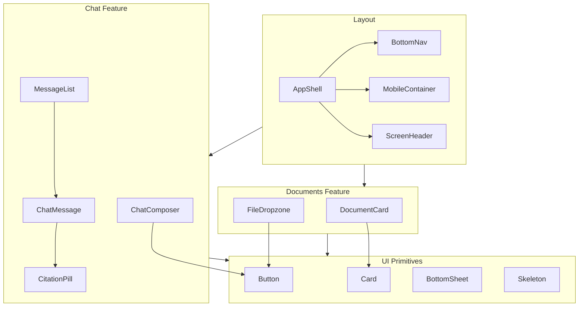

# DocuMind — Component Map

Maps **15 Figma frames** → reusable components. Names align with `apps/web` folders. **Styling pending Figma.**

## Legend

- 🟢 Built (foundation / stub)
- 🟡 Stub — structure only, awaits design
- ⚪ Planned — Phase 2+

---

## Layout & shell

| Component | Used on | Path | Status |
|-----------|---------|------|--------|
| `RootLayout` | All | `app/layout.tsx` | 🟢 |
| `Providers` | All | `app/providers.tsx` | 🟢 |
| `AppShell` | Main app screens | `components/layout/app-shell.tsx` | 🟢 |
| `MobileContainer` | Mobile max-width wrapper | `components/layout/mobile-container.tsx` | 🟢 |
| `BottomNav` | Home, Chat, Settings | `components/layout/bottom-nav.tsx` | 🟡 |
| `ScreenHeader` | Most inner screens | `components/layout/screen-header.tsx` | 🟡 |
| `PageTransition` | Route changes | `components/motion/page-transition.tsx` | 🟢 |

---

## Design system (`components/ui/`)

| Component | Variants / notes | Status |
|-----------|------------------|--------|
| `Button` | primary, secondary, ghost, destructive; sm/md/lg; loading | 🟢 |
| `IconButton` | circular, aria-label required | 🟢 |
| `Input` | text, email, password, error state | 🟢 |
| `Card` | default, interactive (hover lift) | 🟢 |
| `Badge` / `CitationPill` | citation index, page ref | 🟡 |
| `Avatar` | user / document type | 🟡 |
| `Skeleton` | text, card, chat bubble | 🟢 |
| `Spinner` | inline loading | 🟢 |
| `Progress` | upload / processing | 🟡 |
| `Divider` | horizontal | 🟢 |
| `BottomSheet` | citation, share | 🟡 |
| `Toast` | errors, success | ⚪ |

---

## Feedback & empty states

| Component | Screen(s) | Status |
|-----------|-----------|--------|
| `EmptyState` | Home empty, Chat empty | 🟡 |
| `ErrorState` | Offline, generic errors | 🟡 |
| `OfflineBanner` | Inline when connection lost | 🟡 |
| `SplashBrand` | Splash | 🟡 |

---

## Motion

| Component | Purpose | Status |
|-----------|---------|--------|
| `FadeIn` | General enter | 🟢 |
| `SlideUp` | Messages, sheets | 🟢 |
| `StaggerChildren` | List reveals | 🟢 |
| `ThinkingDots` | AI thinking | 🟡 |
| `UploadProgressRing` | Upload screen | ⚪ |

---

## Feature: Auth (`features/auth/`)

| Screen | Components composed | Route | Status |
|--------|---------------------|-------|--------|
| Splash | `SplashBrand`, motion logo | `/` | 🟡 |
| Login | `LoginForm`, `Button`, social auth | `/login` | 🟡 |

---

## Feature: Documents (`features/documents/`)

| Screen | Components composed | Route | Status |
|--------|---------------------|-------|--------|
| Empty Home | `EmptyState`, CTA `Button` | `/home` (empty) | 🟡 |
| Documents Library **(hero 04)** | `DocumentCard` list, `ScreenHeader`, search | `/home` | 🟡 |
| Upload | `FileDropzone`, `Progress` | `/documents/upload` | ⚪ |
| Processing | `ProcessingStatus`, `Skeleton` | `/documents/[id]/processing` | ⚪ |
| Document Detail | metadata, actions, open chat | `/documents/[id]` | ⚪ |

**`DocumentCard`:** thumbnail, title, date, status chip, hover animation.

---

## Feature: Chat (`features/chat/`)

| Screen | Components composed | Route | Status |
|--------|---------------------|-------|--------|
| Chat Empty **(hero 07)** | `EmptyState`, suggested prompts | `/chat` | 🟡 |
| Active Chat **(hero 08)** | `ChatHeader`, `MessageList`, `ChatComposer` | `/chat/[id]` | 🟡 |
| AI Thinking | `ThinkingDots` in thread | inline on `/chat/[id]` | 🟡 |
| Citation Sheet | `BottomSheet`, `CitationPill`, excerpt | overlay | 🟡 |
| Chat History | `ThreadListItem` | `/chat/history` | ⚪ |

**`ChatMessage`:** user | assistant; assistant includes citation pills.

**`ChatComposer`:** input, attach, send; disabled while thinking.

---

## Feature: Settings (`features/settings/`)

| Screen | Components composed | Route | Status |
|--------|---------------------|-------|--------|
| Profile & Settings | sections, theme toggle, sign out | `/settings` | 🟡 |
| Share Sheet | `BottomSheet`, share targets | overlay | ⚪ |

---

## Feature: System

| Screen | Components | Route | Status |
|--------|------------|-------|--------|
| Error / Offline | `ErrorState`, retry | `/offline` | 🟡 |

---

## Dependency graph (simplified)

---

## Screen → component checklist (for Figma QA)

When each frame is delivered, verify:

1. Spacing matches 4px/8px grid from tokens
2. Font sizes/weights match type scale
3. Border radius and shadows match elevation tokens
4. Interactive states (hover, pressed, focus, disabled)
5. Dark mode parity
6. Tablet/desktop breakpoints (if separate frames exist)
